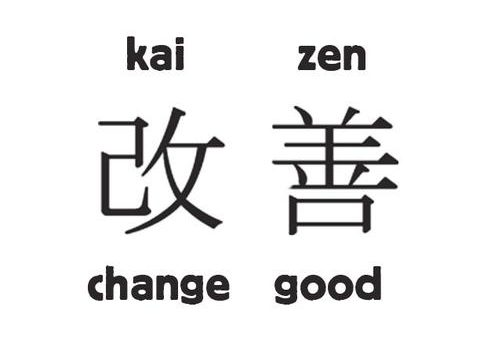
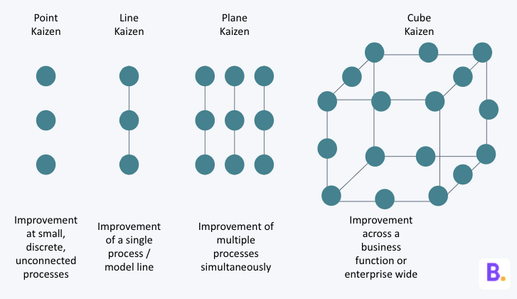
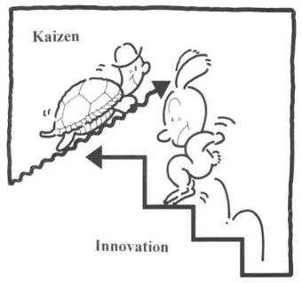
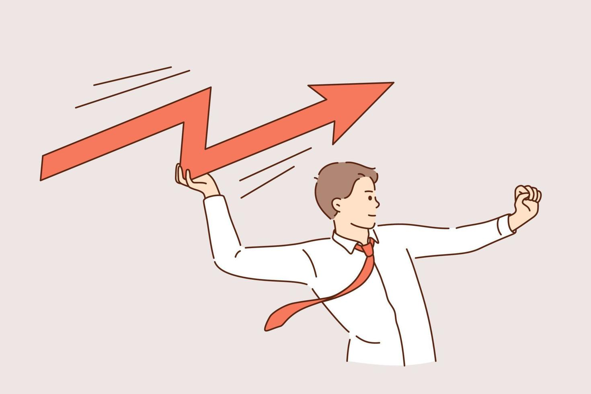

# Introduction à Kaizen

Kaizen : "changement pour le mieux" ou "amélioration continue".

---

# Types de Kaizen

Point, Système, Ligne, Plan, Cube.

---

# Kaizen Point

Le Kaizen Point se concentre sur l'amélioration d'un point spécifique dans un processus.

---

# Kaizen Système

Le Kaizen Système cherche à améliorer un système entier, plutôt qu'un seul point.

---

# Kaizen Ligne

Le Kaizen Ligne vise à améliorer une ligne de production ou un processus du début à la fin.

---

# Kaizen Plan

Le Kaizen Plan concerne l'amélioration planifiée d'un processus ou d'un système sur une période de temps spécifiée.

---

# Kaizen Cube

Le Kaizen Cube représente une amélioration multidimensionnelle, touchant plusieurs processus ou systèmes en même temps.

---

# Kaizen dans Scrum

Facilite les améliorations continues au sein d'une équipe Scrum.

---

# Bénéfices et défis de Kaizen dans Scrum

Kaizen humanise le lieu de travail et encourage la participation de tous les membres de l'équipe. Cependant, s'il prend trop de temps, il peut ralentir le processus de développement.

---

# Conclusion

Kaizen : une méthode efficace pour favoriser l'amélioration continue.

